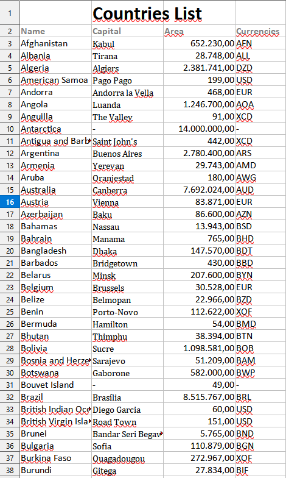

# Desafio de Javascript

Desafio de consumir API Rest e gerar planilha com dados importantes
 

## Instalação

Para realizar a Instalação basta clonar este repositório e digitar o seguinte comando dentro da pasta:

```bash
  npm install 
  node index.js
```
    
## Funcionalidades

- Esse programa acessa a API rest countries e emite uma planilha personalizada ao ser executado.


## Stack utilizada


**Back-end:** Node, Express, Axios, Nodemon("Para testar sem reloads")


## Autores

- [@RafaelClaudio7](https://github.com/RafaelClaudio7)


## Referência

 - [Excel4Node lib](https://github.com/advisr-io/excel4node)
 - [API Rest Countries](https://restcountries.com/)
 

## Resultados



